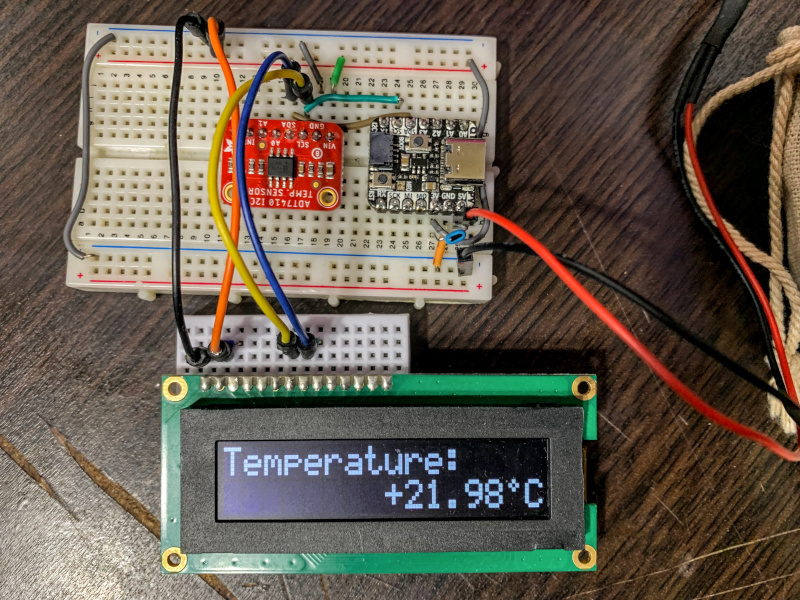

# Display tempreture with Raspberry Pi Pico



## Used Hardwares

* Raspberry Pi Pico or RP2040 Compatible board.
* SO1602 16x2 OLED Character Display Module (I2C connection model)
* ADT7410 High Resolution Tempreture Sensor Module (I2C connection model)

## Preparation

* [The SDK](https://www.raspberrypi.com/documentation/microcontrollers/c_sdk.html) の [Your First Binaries](https://www.raspberrypi.com/documentation/microcontrollers/c_sdk.html#your-first-binaries) を参照し、Raspberry Pi Pico でプログラムを動作させる方法について確認しておきます。

* [Getting started with Raspberry Pi Pico](https://datasheets.raspberrypi.com/pico/getting-started-with-pico.pdf)の
   **Chapter 1. Quick Pico Setup** または、**Chapter 2. The SDK**のいずれかを参照して、Raspberry Pi Pico 開発環境を準備します。

## Build Binary

_以下の手順はUbuntu上で行っています。_

1. このリポジトリをクローンして、クローンしたディレクトリに移動します。

   ``` sh
   git clone https://github.com/yukkeorg/rpi-pico-display-temp.git
   cd rpi-pico-display-temp
   ```

2. `build`ディレクトリを作成してディレクトリをそこに移動します。、

   ``` sh
   mkdir build
   cmake ..
   ```

3. `cmake`コマンドを実行してビルド環境を整えます。

   ``` sh
   cmake -DPICO_SDK_PATH=<path-to-sdk> ..
   ```

4. `ninja`コマンドでビルドします。ビルドが成功すると`showtemp.uf2`が作成されます。

   ``` sh
   ninja
   ```

## Hardware setup

1. Raspberry Pi PicoのGPIO24をSDA、GPIO25をSCLとして、SO1602、ADT7410をI2C接続します。
